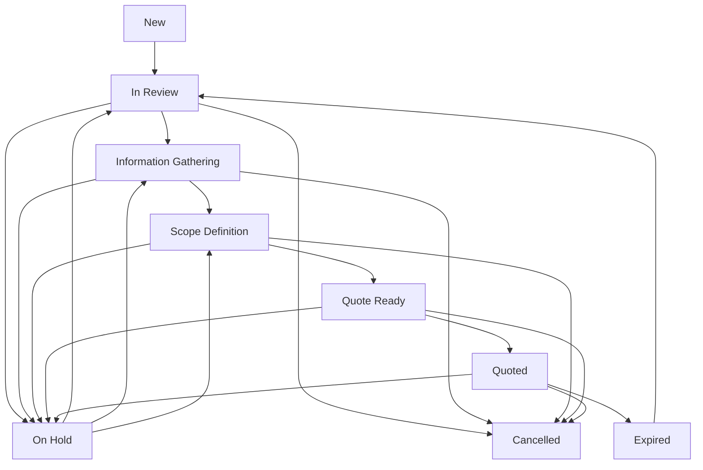

# Case Management System Architecture

## Overview

The RealTechee Case Management System provides comprehensive workflow management for requests from initial submission through quote-ready status. It includes assignment management, communication tracking, status progression, information gathering, and scope definition capabilities.

## Architecture Components

### 1. Database Schema (Amplify Data Models)

#### Enhanced Requests Model
The base `Requests` model has been enhanced with case management fields:

```typescript
// Enhanced fields added to existing Requests model
priority: 'low' | 'medium' | 'high' | 'urgent'
source: string
tags: json // Array of tags for categorization
estimatedValue: float
followUpDate: datetime
lastContactDate: datetime
clientResponseDate: datetime
informationGatheringStatus: 'pending' | 'in_progress' | 'completed'
scopeDefinitionStatus: 'not_started' | 'in_progress' | 'completed'
readinessScore: integer // 0-100 score for quote readiness
missingInformation: json // Array of missing information items
```

#### New Case Management Models

1. **RequestNotes** - Internal notes and client communication tracking
2. **RequestAssignments** - Assignment history and workload management
3. **RequestStatusHistory** - Complete audit trail of status changes
4. **RequestInformationItems** - Information gathering checklist
5. **RequestScopeItems** - Project scope definition with hierarchy
6. **RequestWorkflowStates** - Workflow automation state management

### 2. Backend Services

#### CaseManagementService (`/services/caseManagementService.ts`)
Core service providing CRUD operations for all case management entities:

- **Notes Management**: Add, retrieve, filter case notes
- **Assignment Management**: Assign, transfer, track assignments
- **Status Tracking**: Record status changes with audit trails
- **Information Gathering**: Manage information checklists
- **Scope Definition**: Define and track project scope items
- **Analytics**: Calculate readiness scores and case overviews

#### RequestWorkflowService (`/services/requestWorkflowService.ts`)
Business logic service managing workflow rules and automation:

- **Status Transitions**: Validate and execute status changes
- **Workflow Rules**: Define and enforce business rules
- **Automation**: Check for and execute automated actions
- **Validation**: Ensure requirements are met before status changes

#### EnhancedCaseService (`/services/enhancedCaseService.ts`)
High-level orchestration service providing unified API:

- **Complete Case Management**: Single API for all case operations
- **Workflow Orchestration**: Coordinate between services
- **Data Aggregation**: Combine data from multiple sources
- **Business Logic**: Implement complex case management workflows

### 3. Type Definitions (`/types/caseManagement.ts`)

Comprehensive TypeScript definitions for:
- Core case management entities
- Workflow and validation types
- API response and form types
- Filter and search types
- Constants and enums

## Status Workflow

### Status Progression Flow



### Status Validation Rules

Each status transition includes validation requirements:

- **Scope Definition**: Requires basic information gathering completion
- **Quote Ready**: Requires scope definition and 80+ readiness score
- **Quoted**: Requires approved quote generation

## Information Gathering Workflow

### Standard Information Checklist

When a new request is initialized, the system automatically creates:

1. **Property Address Verification** (Required)
2. **Client Contact Information** (Required)  
3. **Project Timeline Requirements** (Important)
4. **Budget Confirmation** (Required)
5. **Site Assessment Requirements** (Required)

### Information Categories

- **Property**: Address, access, conditions
- **Client**: Contact details, preferences, timeline
- **Project**: Specifications, materials, requirements
- **Financial**: Budget, payment terms, financing
- **Technical**: Assessments, inspections, permits

## Scope Definition System

### Hierarchical Scope Structure

Scope items support parent-child relationships:

```
Kitchen Renovation (Category)
├── Cabinets (System)
│   ├── Upper Cabinets (Item)
│   └── Lower Cabinets (Item)
├── Countertops (System)
│   ├── Quartz Installation (Service)
│   └── Edge Treatment (Service)
└── Appliances (System)
    ├── Refrigerator (Material)
    └── Dishwasher (Material)
```

### Scope Categories

- **Room**: Kitchen, Bathroom, Living Room
- **Area**: Countertops, Flooring, Walls
- **System**: Plumbing, Electrical, HVAC
- **Material**: Tiles, Paint, Fixtures
- **Service**: Installation, Removal, Inspection

## Assignment Management

### Assignment Types

- **Primary**: Main responsible person
- **Secondary**: Supporting team member
- **Observer**: Notification-only access

### Workload Tracking

- Estimated vs. actual hours
- Assignment priority levels
- Due date management
- Transfer capability with reason tracking

## Communication Tracking

### Note Types

- **Internal**: Team-only communication
- **Client Communication**: External interactions
- **Technical**: Technical specifications and requirements
- **Follow-up**: Action items and reminders

### Communication Methods

- Phone calls
- Email exchanges
- Text messages
- In-person meetings
- Other methods

## Automation Features

### Workflow Automation

The system automatically:

1. **Creates Standard Checklists**: Information gathering items for new requests
2. **Calculates Readiness Scores**: Based on completion of required items
3. **Suggests Status Transitions**: When requirements are met
4. **Sets Follow-up Reminders**: Based on communication patterns
5. **Identifies Stale Requests**: Cases inactive for 7+ days

### Readiness Score Calculation

- **Information Gathering (40 points)**: Required items completed
- **Scope Definition (40 points)**: Approved scope items
- **Communication (20 points)**: Recent client interactions

## API Integration

### Enhanced API Endpoints

All new models are integrated into the existing AmplifyAPI structure:

```typescript
// Case Management APIs
import { 
  requestNotesAPI,
  requestAssignmentsAPI,
  requestStatusHistoryAPI,
  requestInformationItemsAPI,
  requestScopeItemsAPI,
  requestWorkflowStatesAPI
} from '../utils/amplifyAPI';
```

### Service Usage Examples

```typescript
// Get complete case with all related data
const caseData = await enhancedCaseService.getCompleteCase(requestId);

// Add note with follow-up
await enhancedCaseService.addNote(requestId, {
  content: "Discussed timeline with client",
  type: "client_communication",
  followUpRequired: true,
  followUpDate: "2024-01-15"
}, userId, userName, userRole);

// Change status with validation
const statusResult = await enhancedCaseService.changeCaseStatus(
  requestId, 
  "Quote Ready", 
  userId, 
  "All requirements completed"
);

// Get information gathering progress
const progress = await enhancedCaseService.getInformationGatheringProgress(requestId);
```

## Frontend Integration

### Enhanced RequestDetail Component

The existing RequestDetail component should be enhanced with:

1. **Notes Section**: Add, view, filter case notes
2. **Assignment Panel**: Manage team assignments
3. **Progress Tracking**: Visual progress indicators
4. **Information Checklist**: Interactive information gathering
5. **Scope Definition**: Hierarchical scope builder
6. **Status Management**: Guided status transitions

### New Component Architecture

```
RequestDetail/
├── components/
│   ├── NotesSection/
│   ├── AssignmentPanel/
│   ├── ProgressTracker/
│   ├── InformationChecklist/
│   ├── ScopeBuilder/
│   └── StatusManager/
├── hooks/
│   ├── useCaseManagement.ts
│   ├── useWorkflowState.ts
│   └── useReadinessScore.ts
└── types/
    └── requestDetail.ts
```

## Security and Permissions

### Access Control

- **Admin**: Full access to all case management features
- **Agent**: Access to assigned cases and public information
- **Project Manager**: Access to scope definition and technical details
- **Observer**: Read-only access to case progress

### Data Privacy

- Internal notes marked as private
- Client communication tracked separately
- Audit trails for all changes
- Role-based field visibility

## Performance Considerations

### Database Optimization

- Indexed fields for common queries
- Pagination for large datasets
- Efficient relationships using Amplify Gen 2
- Background processing for automation

### Caching Strategy

- Case overview data cached for 5 minutes
- Readiness scores calculated on-demand
- Assignment data cached per user session
- Status transitions logged asynchronously

## Deployment and Migration

### Schema Deployment

1. **Backup Current Data**: Use `./scripts/backup-data.sh`
2. **Deploy Schema Changes**: `npx ampx sandbox`
3. **Migrate Existing Requests**: Run migration scripts
4. **Test Functionality**: Verify all services work correctly

### Data Migration Strategy

```typescript
// Migrate existing requests to enhanced schema
async function migrateExistingRequests() {
  const requests = await requestsAPI.list();
  
  for (const request of requests.data) {
    // Initialize case management for existing requests
    await enhancedCaseService.initializeNewCase(request.id);
  }
}
```

## Monitoring and Analytics

### Key Metrics

- Average time to quote-ready status
- Information gathering completion rates
- Scope definition accuracy
- Assignment workload distribution
- Status transition patterns

### Reporting Dashboard

Future enhancements should include:

1. **Case Pipeline Reports**: Status distribution and progression
2. **Team Performance**: Assignment completion rates and times
3. **Client Communication**: Response rates and follow-up effectiveness
4. **Readiness Score Trends**: Improvement over time
5. **Bottleneck Analysis**: Where cases get stuck in the pipeline

## Future Enhancements

### Planned Features

1. **AI-Powered Suggestions**: Automatic scope item recommendations
2. **Client Portal Integration**: Allow clients to update information
3. **Mobile App Support**: Field updates and photo uploads
4. **Advanced Automation**: Machine learning for assignment optimization
5. **Integration APIs**: Connect with external tools and services

### Scalability Improvements

1. **Event-Driven Architecture**: Implement event sourcing for audit trails
2. **Microservices Split**: Separate services for different case aspects
3. **Real-time Updates**: WebSocket connections for live case updates
4. **Advanced Caching**: Redis for complex query results
5. **Background Processing**: Queue system for heavy operations

## Conclusion

This comprehensive case management system transforms the simple request tracking into a sophisticated workflow management platform. It provides the tools needed to efficiently manage the entire lifecycle from initial client contact through quote-ready status, with proper accountability, communication tracking, and progress monitoring.

The modular architecture ensures easy maintenance and future enhancements while the robust typing system provides excellent developer experience and reduces bugs. The automation features reduce manual work while the audit trails provide complete transparency into case progression.