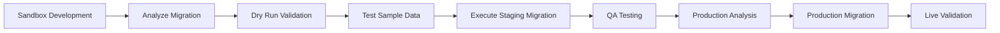

# 🔄 Data Migration Scripts

Enterprise-grade migration tools for RealTechee 2.0 Amplify Gen 2 environment management.

## 📋 Overview

Two comprehensive migration scripts implementing the **Hybrid Three-Stack Approach** from `AMPLIFY_ENV_PLAN.md`:

| Script | Purpose | Source | Target | Safety Level |
|--------|---------|--------|--------|--------------|
| `migrate-sandbox-to-staging.sh` | Development to QA | Sandbox | New Staging | Standard |
| `migrate-staging-to-production.sh` | QA to Live | New Staging | Production | **Maximum** |

## � Current Backend Suffix Map

| Purpose | Suffix | Notes |
|---------|--------|-------|
| Legacy Shared Dev/Staging (old) | `fvn7t5hbobaxjklhrqzdl4ac34` | Previous shared dev+staging dataset (kept temporarily for local reference) |
| New Staging (active) | `irgzgwsfnzba3fqtum5k2eyp4m` | Primary non‑prod stack (All branches env vars) |
| Production (active) | `yk6ecaswg5aehj3ev76xzpbe` | Live stack |

Migration sequence now requires a two-phase bootstrap: (1) legacy staging → new staging, (2) new staging → production.

> Clarification: The suffix `fvn7t5hbobaxjklhrqzdl4ac34` represents the prior combined dev/staging backend that local developers have been pointing to. It is NOT automatically deleted after bootstrap. We will retain it until (a) new staging + sandbox workflows are fully validated and (b) all required historical data is verified in the new stacks. Decommissioning (deleting tables / stack) becomes an explicit, scheduled cleanup step once confidence is established. If desired, we can also repurpose it as a long‑term sandbox snapshot.

## �🚀 Quick Start

### 1. Sandbox → New Staging Migration (Standard Dev Sync)

```bash
# Set environment variables
export SOURCE_BACKEND_SUFFIX="fvn7t5hbobaxjklhrqzdl4ac34"
export TARGET_BACKEND_SUFFIX="irgzgwsfnzba3fqtum5k2eyp4m"
export AWS_REGION="us-west-1"

# Migration workflow
./scripts/migrate-sandbox-to-staging.sh analyze          # Analyze what will be migrated
./scripts/migrate-sandbox-to-staging.sh dry-run         # Validate without changes
./scripts/migrate-sandbox-to-staging.sh test Contacts 5 # Test with 5 sample records
./scripts/migrate-sandbox-to-staging.sh migrate         # Execute full migration
```

### 2. New Staging → Production Migration

```bash
# Set production environment
export SOURCE_BACKEND_SUFFIX="irgzgwsfnzba3fqtum5k2eyp4m"
export TARGET_BACKEND_SUFFIX="yk6ecaswg5aehj3ev76xzpbe"
export AWS_REGION="us-west-1"

# Production workflow (enhanced safety)
./scripts/migrate-staging-to-production.sh analyze      # Production safety analysis
./scripts/migrate-staging-to-production.sh dry-run     # Validate production readiness
./scripts/migrate-staging-to-production.sh migrate     # PRODUCTION DEPLOYMENT

### 3. One-Time Legacy → New Staging Bootstrap (ALREADY REQUIRED BEFORE REGRESSION)

Run this ONLY ONCE to move existing data from the old staging suffix to the new staging & production environments:

```bash
# Phase A: Legacy Staging -> New Staging
export SOURCE_BACKEND_SUFFIX="fvn7t5hbobaxjklhrqzdl4ac34"   # legacy
export TARGET_BACKEND_SUFFIX="irgzgwsfnzba3fqtum5k2eyp4m"   # new staging
export AWS_REGION="us-west-1"
./scripts/migrate-sandbox-to-staging.sh analyze
./scripts/migrate-sandbox-to-staging.sh dry-run
./scripts/migrate-sandbox-to-staging.sh migrate

# Validation checkpoint (counts, sample queries)

# Phase B: New Staging -> Production (synchronize production before frontend cutover)
export SOURCE_BACKEND_SUFFIX="irgzgwsfnzba3fqtum5k2eyp4m"   # new staging
export TARGET_BACKEND_SUFFIX="yk6ecaswg5aehj3ev76xzpbe"   # production
./scripts/migrate-staging-to-production.sh analyze
./scripts/migrate-staging-to-production.sh dry-run
./scripts/migrate-staging-to-production.sh migrate
```

After both phases: lock (or delete) legacy staging resources to prevent drift.

### 4. Single-Pass Full Chain Bootstrap (All Tables, Hard-Coded)

If you want a single command to export every legacy table (expected 33) and import into both new staging and production preserving IDs, use:

```bash
./scripts/migrate-onetime-fullchain.sh all
```

Step breakdown:
```bash
./scripts/migrate-onetime-fullchain.sh export      # Export legacy tables to JSON
./scripts/migrate-onetime-fullchain.sh staging     # Import export -> new staging
./scripts/migrate-onetime-fullchain.sh production  # Import export -> production
```

Properties:
- Hardcoded suffixes: legacy=fvn7t5hbobaxjklhrqzdl4ac34, staging=irgzgwsfnzba3fqtum5k2eyp4m, production=yk6ecaswg5aehj3ev76xzpbe
- Exports each legacy table to backups/migrations/fullchain_export_<timestamp>
- Reuses SAME export JSON for both target imports (ensures identical dataset)
- Item IDs preserved (no FK or suffix rewriting performed)
- Validation via approximate ItemCount + deep scan fallback if lower than expected
- Safe to re-run (idempotent for unchanged rows)
- Intended only for initial bootstrap; subsequent deltas should use targeted scripts if needed
```

## 🛡️ Security & Safety Features

### Sandbox → Staging Script
- Environment variable validation
- AWS permissions checking
- Table structure discovery
- Backup creation before migration
- Batch processing with error handling
- Comprehensive logging

### Staging → Production Script
- **Multi-level confirmation** (stakeholder notification, backup confirmation)
- **Production safety analysis** (existing data detection)
- **Enhanced error handling** with retry logic
- **Comprehensive backup** of all production data
- **Rollback capability** through backup files
- **Audit trail** with detailed logging

## 📊 Core Tables Migrated

Both scripts migrate these core business tables:

- `Requests` - Main request submissions
- `Contacts` - Contact records (agents, homeowners)
- `Projects` - Project management data
- `Properties` - Property information
- `BackOfficeRequestStatuses` - Status tracking
- `Users` - User account data
- `Notifications` - Notification records
- `ProjectImages` - Project image metadata
- `PropertyImages` - Property image metadata
- `Documents` - Document metadata

## 🔧 Command Options

### Available Commands

| Command | Description | Safety | Use Case |
|---------|-------------|--------|-----------|
| `analyze` | Generate migration analysis report | ✅ Safe | Planning & scoping |
| `dry-run` | Validate without making changes | ✅ Safe | Pre-migration validation |
| `test` | Test with sample data | ⚠️ Limited | Validation with real data |
| `migrate` | Full migration | ⚠️ Destructive | Production deployment |
| `help` | Show usage information | ✅ Safe | Documentation |

### Test Command Examples

```bash
# Test single record from Contacts table
./scripts/migrate-sandbox-to-staging.sh test Contacts

# Test 3 records from Properties table
./scripts/migrate-sandbox-to-staging.sh test Properties 3

# Test 5 records from Projects table  
./scripts/migrate-sandbox-to-staging.sh test Projects 5
```

## 📁 Output Files

### Generated Files

| File | Purpose | Location |
|------|---------|----------|
| `migration-analysis-*.json` | Migration scope analysis | `scripts/` |
| `migration-report-*.json` | Completed migration report | `scripts/` |
| `discovered-tables-*.json` | Table structure discovery | `scripts/` |
| `*_backup_*.json` | Data backup before migration | `backups/migrations/` |
| `migration_*.log` | Detailed migration logs | `logs/` |

### Example Output Structure
```
scripts/
├── migration-analysis-20250811_142030.json
├── migration-report-20250811_143045.json
└── discovered-tables-20250811_142030.json

backups/migrations/
└── staging_backup_20250811_143000.json

logs/
└── migration_sandbox_to_staging_20250811_142030.log
```

## ⚙️ Environment Variables

### Required Variables

| Variable | Description | Example |
|----------|-------------|---------|
| `SOURCE_BACKEND_SUFFIX` | Source environment backend suffix | `abc123def456` |
| `TARGET_BACKEND_SUFFIX` | Target environment backend suffix | `irgzgwsfnzba3fqtum5k2eyp4m` |
| `AWS_REGION` | AWS region for resources | `us-west-1` |

### Optional Variables

| Variable | Description | Default |
|----------|-------------|---------|
| `MIGRATION_DEFAULT_PASSWORD` | Default password for Cognito users | `Sababa123!` |
| `AWS_ACCESS_KEY_ID` | AWS credentials | From `aws configure` |
| `AWS_SECRET_ACCESS_KEY` | AWS credentials | From `aws configure` |

## 🔍 Prerequisites

### System Requirements
- **AWS CLI** installed and configured
- **Node.js** for JSON processing
- **jq** (optional, Node.js fallback available)
- **Bash 4.0+** for script execution

### AWS Permissions Required
- **DynamoDB**: `ListTables`, `DescribeTable`, `Scan`, `PutItem`, `BatchWriteItem`
- **Cognito**: `ListUserPools` (for user migration features)
- **IAM**: `GetCallerIdentity` (for account validation)

### Validation Commands
```bash
# Check AWS CLI
aws --version

# Check Node.js
node --version

# Test AWS permissions
aws sts get-caller-identity
aws dynamodb list-tables --region us-west-1
```

## 🚨 Production Migration Warnings

### Critical Considerations
- **Live data impact**: Production migration affects real user data
- **Stakeholder notification**: All stakeholders must be notified before production migration
- **Service downtime**: Migration may require brief service interruption
- **Backup requirement**: Complete production backup must be created
- **Testing requirement**: Thoroughly test in staging environment first

### Production Confirmation Process
1. Stakeholder notification confirmation
2. Production backup completion confirmation
3. Type `PRODUCTION-MIGRATE` to confirm
4. Type `DEPLOY-TO-PROD` for final confirmation

## 📋 Migration Workflow

### Standard Development Workflow



### Best Practices
1. **Always start with `analyze`** to understand scope
2. **Run `dry-run`** to validate permissions and table structure
3. **Test with samples** using `test` command before full migration
4. **Create manual backup** of critical data before production migration
5. **Monitor logs** during migration for early error detection
6. **Validate application** functionality after migration

## 🔧 Troubleshooting

### Common Issues

| Issue | Solution |
|-------|----------|
| AWS credentials not configured | Run `aws configure` or set environment variables |
| Missing source/target tables | Deploy backend to target environment first |
| Permission denied errors | Validate IAM permissions for DynamoDB operations |
| Large dataset timeouts | Migration uses batch processing, monitor logs |
| Network connectivity issues | Scripts include retry logic for transient failures |

### Debug Commands
```bash
# Check AWS credentials
aws sts get-caller-identity

# List tables in region
aws dynamodb list-tables --region us-west-1

# Check specific table
aws dynamodb describe-table --table-name TableName-suffix-NONE --region us-west-1
```

## 📞 Support

For issues with migration scripts:

1. **Check logs** in `logs/migration_*.log` for detailed error information
2. **Review backup files** in `backups/migrations/` for rollback data
3. **Validate prerequisites** using the commands in this README
4. **Run analysis** first to identify potential issues before migration

## 🎯 Version Information

- **Script Version**: 1.0.0
- **Compatible with**: Amplify Gen 2 Single-App Multi-Branch architecture
- **AWS Region**: us-west-1 (configurable)
- **Last Updated**: August 11, 2025

---

*These migration scripts are part of the RealTechee 2.0 Amplify Gen 2 Environment Plan implementation, providing enterprise-grade data migration capabilities for the hybrid three-stack architecture.*